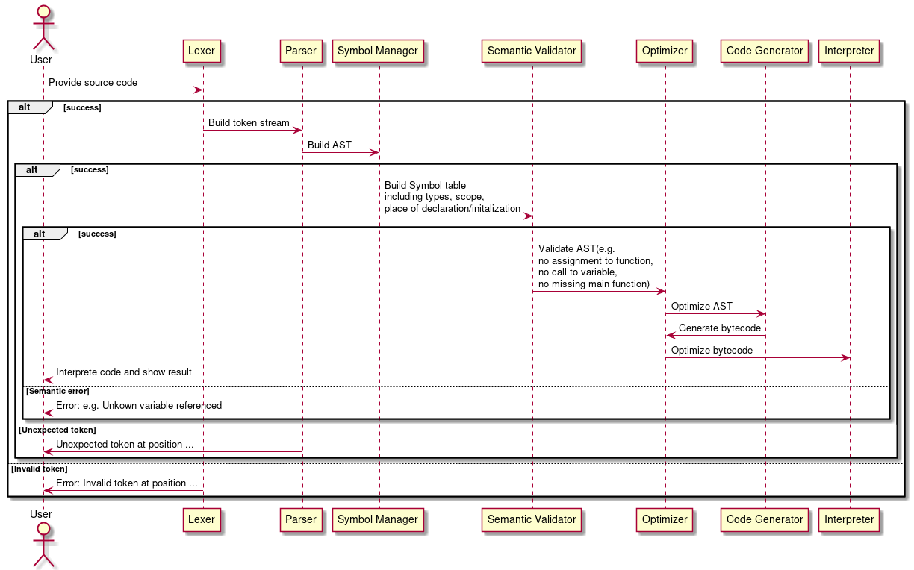

# MVPL
The **M**inimum **V**iable **P**rogramming **L**anguage (**MVPL**) planned to be implemented through a custom lexer, parser, bytecode generator, bytecode interpreter and simple optimizer.


# Components
## Lexer
The lexer turns a program like this:
```javascript

function main()
{
    return 5;
}
```
int a *token stream* like this:
```json
{
  "token_stream": [
    {
      "value": "function",
      "type": "FUNCTION",
      "source_location_": {
        "line_start": 0,
        "col_start": 0,
        "line_end": 0,
        "col_end": 8
      }
    },
    {
      "value": "main",
      "type": "IDENTIFIER",
      "source_location_": {
        "line_start": 0,
        "col_start": 9,
        "line_end": 0,
        "col_end": 13
      }
    },
    {
      "value": "(",
      "type": "LPAREN",
      "source_location_": {
        "line_start": 0,
        "col_start": 13,
        "line_end": 0,
        "col_end": 14
      }
    },
    {
      "value": ")",
      "type": "RPAREN",
      "source_location_": {
        "line_start": 0,
        "col_start": 14,
        "line_end": 0,
        "col_end": 15
      }
    },
    {
      "value": "{",
      "type": "LBRACAE",
      "source_location_": {
        "line_start": 1,
        "col_start": 0,
        "line_end": 1,
        "col_end": 1
      }
    },
    {
      "value": "return",
      "type": "RETURN",
      "source_location_": {
        "line_start": 2,
        "col_start": 4,
        "line_end": 2,
        "col_end": 10
      }
    },
    {
      "value": "5",
      "type": "LITERAL",
      "source_location_": {
        "line_start": 2,
        "col_start": 11,
        "line_end": 2,
        "col_end": 12
      }
    },
    {
      "value": ";",
      "type": "SEMICOLON",
      "source_location_": {
        "line_start": 2,
        "col_start": 12,
        "line_end": 2,
        "col_end": 13
      }
    },
    {
      "value": "}",
      "type": "RBRACE",
      "source_location_": {
        "line_start": 3,
        "col_start": 0,
        "line_end": 3,
        "col_end": 1
      }
    }
  ]
}
```

## Parser

The parser is a *recursive descent parser* and uses *parser combinators*, and a *pratt parser* for dealing with operator precedence.

The parser turns a token stream like this:
```json
{
  "token_stream": [
    {
      "value": "function",
      "type": "FUNCTION",
      "source_location_": {
        "line_start": 0,
        "col_start": 0,
        "line_end": 0,
        "col_end": 8
      }
    },
    {
      "value": "main",
      "type": "IDENTIFIER",
      "source_location_": {
        "line_start": 0,
        "col_start": 9,
        "line_end": 0,
        "col_end": 13
      }
    },
    {
      "value": "(",
      "type": "LPAREN",
      "source_location_": {
        "line_start": 0,
        "col_start": 13,
        "line_end": 0,
        "col_end": 14
      }
    },
    {
      "value": ")",
      "type": "RPAREN",
      "source_location_": {
        "line_start": 0,
        "col_start": 14,
        "line_end": 0,
        "col_end": 15
      }
    },
    {
      "value": "{",
      "type": "LBRACAE",
      "source_location_": {
        "line_start": 1,
        "col_start": 0,
        "line_end": 1,
        "col_end": 1
      }
    },
    {
      "value": "return",
      "type": "RETURN",
      "source_location_": {
        "line_start": 2,
        "col_start": 4,
        "line_end": 2,
        "col_end": 10
      }
    },
    {
      "value": "5",
      "type": "LITERAL",
      "source_location_": {
        "line_start": 2,
        "col_start": 11,
        "line_end": 2,
        "col_end": 12
      }
    },
    {
      "value": ";",
      "type": "SEMICOLON",
      "source_location_": {
        "line_start": 2,
        "col_start": 12,
        "line_end": 2,
        "col_end": 13
      }
    },
    {
      "value": "}",
      "type": "RBRACE",
      "source_location_": {
        "line_start": 3,
        "col_start": 0,
        "line_end": 3,
        "col_end": 1
      }
    }
  ]
}
```

into an *absract syntax tree* (AST) like this:
```json
{
}
```

# Roadmap
- [x] Functional lexer
- [ ] [Functional parser](https://github.com/JonasMuehlmann/MVPL/milestone/1)
- [ ] [Functional semantic analyser](https://github.com/JonasMuehlmann/MVPL/milestone/8)
- [ ] [Functional code generator](https://github.com/JonasMuehlmann/MVPL/milestone/2)
- [ ] [Functional interpreter](https://github.com/JonasMuehlmann/MVPL/milestone/3)
- [ ] [Pointer support](https://github.com/JonasMuehlmann/MVPL/milestone/7)
- [ ] [Struct support](https://github.com/JonasMuehlmann/MVPL/milestone/5)
- [ ] [Array support](https://github.com/JonasMuehlmann/MVPL/milestone/6)
- [ ] [Functional Optimizer](https://github.com/JonasMuehlmann/MVPL/milestone/4)
